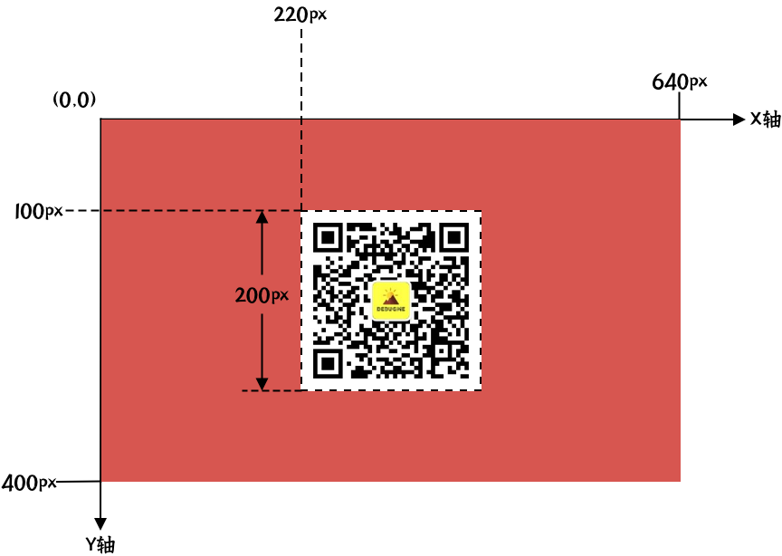

# 蓝图
蓝图就是渲染配置，服务根据传入的蓝图进行渲染。蓝图除了配置图片的基础信息，还包含了由各种组件组成的图片内容。

## 参数
| 字段名          | 数据类型       | 默认值 | 必需 | 描述                                                     |
| :---------------: | :--------------: | :------: | :----: | ------------------------------------------------------------ |
| width           | int            |        | yes  | 图片宽度，内容不能超过此宽度                                 |
| height          | int            |        | yes  | 图片高度，内容不能超过此高度                                 |
| backgroundColor | Hex Color Code |        | yes  | 图片背景颜色                                                 |
| borderColor             | Hex Color Code | #000000 |            | 四条边框颜色                                      |
| borderWidth             | int            | 0       |            | 四条边框宽度，边框宽度一半在内部，一半在外。      |
| borderTopColor          | Hex Color Code | #000000 |            | 上边框边框颜色，优先级高于 `borderColor`          |
| borderTopWidth          | int            | 0       |            | 上边框边框宽度，优先级高于 `borderWidth`          |
| borderBottomColor       | Hex Color Code | #000000 |            | 下边框边框颜色，优先级高于 `borderColor`          |
| borderBottomWidth       | int            | 0       |            | 下边框边框宽度，优先级高于 `borderWidth`          |
| borderLeftColor         | Hex Color Code | #000000 |            | 左边框边框颜色，优先级高于 `borderColor`          |
| borderLeftWidth         | int            | 0       |            | 左边框边框宽度，优先级高于 `borderWidth`          |
| borderRightColor        | Hex Color Code | #000000 |            | 右边框边框颜色，优先级高于 `borderColor`          |
| borderRightWidth        | int            | 0       |            | 右边框边框宽度，优先级高于 `borderWidth`          |
| borderRadius            | int            | 0       |            | 边框四个顶点圆角半径                              |
| borderTopLeftRadius     | int            | 0       |            | 边框左上角顶点圆角半径，优先级高于 `borderRadius` |
| borderTopRightRadius    | int            | 0       |            | 边框右上角顶点圆角半径，优先级高于 `borderRadius` |
| borderBottomLeftRadius  | int            | 0       |            | 边框左下角顶点圆角半径，优先级高于 `borderRadius` |
| borderBottomRightRadius | int            | 0       |            | 边框右下角顶点圆角半径，优先级高于 `borderRadius` |
| texts           | Array          | []     |      | 图片中的文字内容，由 [文本组件](/docs/components/text) 进行组成 |
| images          | Array          | []     |      | 图片中的图像内容，可以将外部图片渲染到新图片上，由 [图片组件](/docs/components/image) 组成 |
| lines           | Array          | []     |      | 图片中的线段，可用于渲染一些分界线，由 [线段组件](/docs/components/line) 组成 |
| qrcodes         | Array          | []     |      | 图片中的二维码内容，可以在图片上渲染二维码内容，由 [二维码组件](/docs/components/qrcode) 组成 |
| blocks          | Array          | []     |      | 图片中的纯色矩形，由 [矩形组件](/docs/components/block) 组成 |

在配置蓝图时，推荐按文字、图片、矩形、直线、二维码等元素对图片内容进行拆解，先做出设计稿，再进行参数化，根据实际渲染结果进行微调。
## 坐标系
坐标系规则为：从左至右为 X 轴，从上至下为 Y 轴，单位为像素（px）。

蓝图的左上角为`全局坐标原点（0，0）`。



在默认情况下，组件的定位锚点在左上角，均以`全局坐标原点`为参照。例如上图中，二维码图片的（x, y）参数为：(220, 100)。

## 注意事项
:::danger
目前暂未限制蓝图的尺寸，但推荐尺寸：`宽度 < 640, 高度 < 1100`。尺寸过大，会导致渲染速度下降。

减少不必要的外部图片元素，避免引擎下载图片失败，而导致渲染失败。
:::

## 示例
```json
{
    "width": 640,
    "height": 1034,
    "backgroundColor": "#d04c44",
    "blocks": [],
    "texts": [],
    "images": [],
    "qrcodes": [],
    "lines": []
}
```
