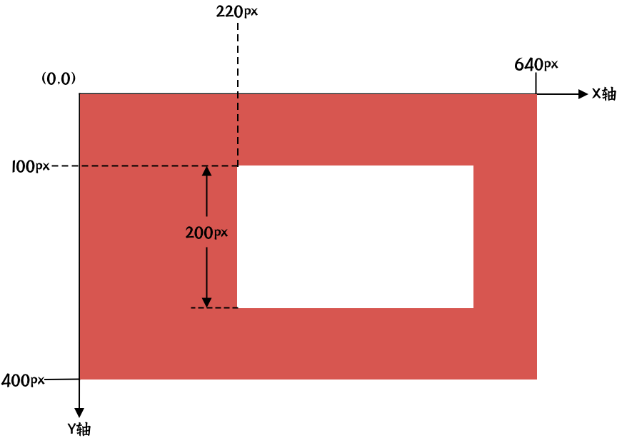

# 矩形

## 参数
| 字段名          | 数据类型       | 默认值  | 必需 | 描述                                       |
| :-------------: | :------------: | :-----: | :--: | ------------------------------------------ |
| x               | int            |         | yes  | 矩形 X 坐标                                |
| y               | int            |         | yes  | 矩形 Y 坐标                                |
| width           | int            |         | yes  | 矩形宽度                                   |
| height          | int            |         | yes  | 矩形高度                                   |
| backgroundColor | Hex Color Code | #000000 |      | 背景颜色                                   |
| borderColor             | Hex Color Code | #000000 |            | 四条边框颜色                                      |
| borderWidth             | int            | 0       |            | 四条边框宽度，边框宽度一半在内部，一半在外。      |
| borderTopColor          | Hex Color Code | #000000 |            | 上边框边框颜色，优先级高于 `borderColor`          |
| borderTopWidth          | int            | 0       |            | 上边框边框宽度，优先级高于 `borderWidth`          |
| borderBottomColor       | Hex Color Code | #000000 |            | 下边框边框颜色，优先级高于 `borderColor`          |
| borderBottomWidth       | int            | 0       |            | 下边框边框宽度，优先级高于 `borderWidth`          |
| borderLeftColor         | Hex Color Code | #000000 |            | 左边框边框颜色，优先级高于 `borderColor`          |
| borderLeftWidth         | int            | 0       |            | 左边框边框宽度，优先级高于 `borderWidth`          |
| borderRightColor        | Hex Color Code | #000000 |            | 右边框边框颜色，优先级高于 `borderColor`          |
| borderRightWidth        | int            | 0       |            | 右边框边框宽度，优先级高于 `borderWidth`          |
| borderRadius            | int            | 0       |            | 边框四个顶点圆角半径                              |
| borderTopLeftRadius     | int            | 0       |            | 边框左上角顶点圆角半径，优先级高于 `borderRadius` |
| borderTopRightRadius    | int            | 0       |            | 边框右上角顶点圆角半径，优先级高于 `borderRadius` |
| borderBottomLeftRadius  | int            | 0       |            | 边框左下角顶点圆角半径，优先级高于 `borderRadius` |
| borderBottomRightRadius | int            | 0       |            | 边框右下角顶点圆角半径，优先级高于 `borderRadius` |
| zIndex          | int            | 0       |      | 渲染层级，会影响同一位置不同内容的覆盖情况 |




## 示例
```json
{
    "x": 220,
    "y": 100,
    "width": 380,
    "height": 200,
    "backgroundColor": "#fff",
    "borderColor": "#fff"
}
```
