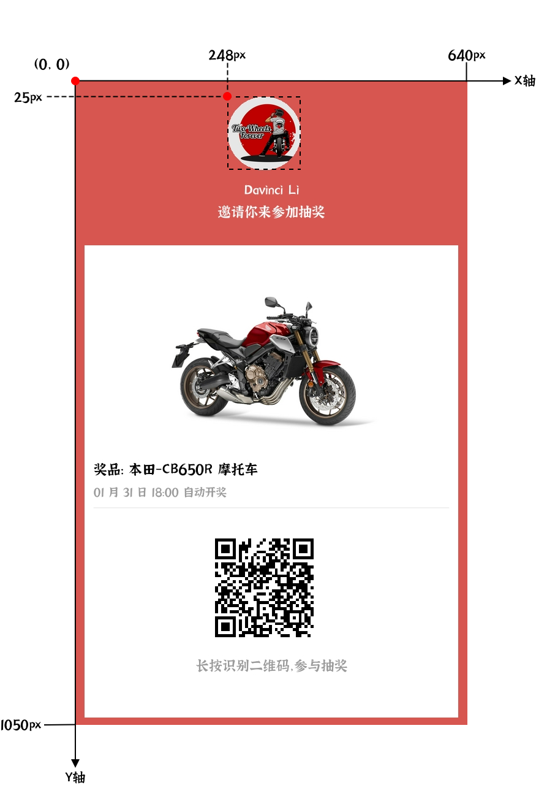

# 图片

## 参数

| 字段名 | 数据类型 | 默认值 | 必需 | 描述                                   |
| :------: | :-------: | :----: | :--: | ----------------------------------------- |
| x      | int      |        | yes  | 图片 X 坐标                                |
| y      | int      |        | yes  | 图片 Y 坐标                                |
| url    | url      |        | yes  | 图片链接，需要保证图片能够正常访问下载     |
| width  | int      |        | yes  | 图片渲染宽度，用于缩放图片                 |
| height | int      |        | yes  | 图片渲染高度，用于缩放图片                 |
| borderColor             | Hex Color Code | #000000 |            | 四条边框颜色                                      |
| borderWidth             | int            | 0       |            | 四条边框宽度，边框宽度一半在内部，一半在外。      |
| borderTopColor          | Hex Color Code | #000000 |            | 上边框边框颜色，优先级高于 `borderColor`          |
| borderTopWidth          | int            | 0       |            | 上边框边框宽度，优先级高于 `borderWidth`          |
| borderBottomColor       | Hex Color Code | #000000 |            | 下边框边框颜色，优先级高于 `borderColor`          |
| borderBottomWidth       | int            | 0       |            | 下边框边框宽度，优先级高于 `borderWidth`          |
| borderLeftColor         | Hex Color Code | #000000 |            | 左边框边框颜色，优先级高于 `borderColor`          |
| borderLeftWidth         | int            | 0       |            | 左边框边框宽度，优先级高于 `borderWidth`          |
| borderRightColor        | Hex Color Code | #000000 |            | 右边框边框颜色，优先级高于 `borderColor`          |
| borderRightWidth        | int            | 0       |            | 右边框边框宽度，优先级高于 `borderWidth`          |
| borderRadius            | int            | 0       |            | 边框四个顶点圆角半径                              |
| borderTopLeftRadius     | int            | 0       |            | 边框左上角顶点圆角半径，优先级高于 `borderRadius` |
| borderTopRightRadius    | int            | 0       |            | 边框右上角顶点圆角半径，优先级高于 `borderRadius` |
| borderBottomLeftRadius  | int            | 0       |            | 边框左下角顶点圆角半径，优先级高于 `borderRadius` |
| borderBottomRightRadius | int            | 0       |            | 边框右下角顶点圆角半径，优先级高于 `borderRadius` |
| zIndex | int      | 0      |      | 渲染层级，会影响同一位置不同内容的覆盖情况 |




## 示例
```json
{
    "x": 248,
    "y": 25,
    "width": 120,
    "height": 120,
    "url": "https://img-chengxiaoli-1253325493.cos.ap-beijing.myqcloud.com/bikers_327390-13.jpg",
    "borderRadius": 60,
    "zIndex": 1
}
```
