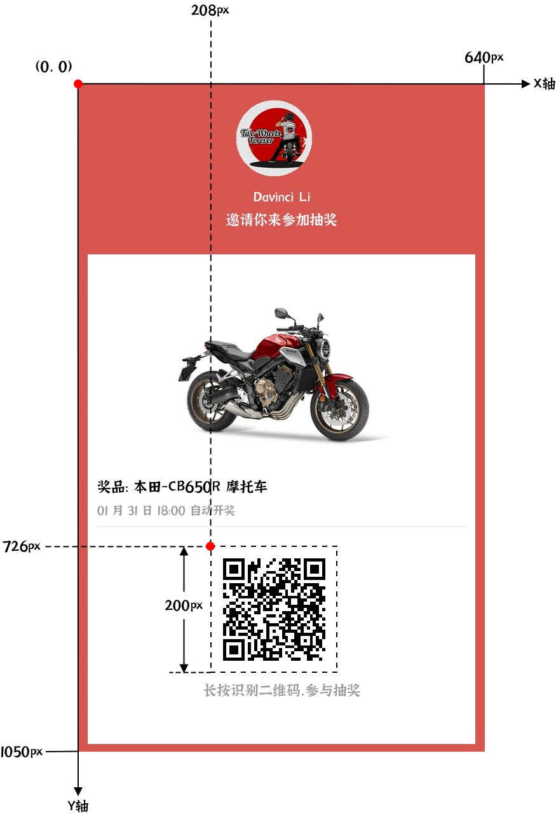

# 二维码

## 参数

| 字段名          | 数据类型       | 默认值  | 必需 | 描述                                       |
| :-------------: | :------------: | :-----: | :--: | ------------------------------------------ |
| x               | int            |         | yes  | 二维码 X 坐标                              |
| y               | int            |         | yes  | 二维码 Y 坐标                              |
| size            | int            |         | yes  | 正方形二维码尺寸大小                       |
| content         | string         |         | yes  | 二维码内容                                 |
| foregroundColor | Hex Color Code | #000000 |      | 二维码前景色                               |
| backgroundColor | Hex Color Code | #ffffff |      | 二维码背景色                               |
| zIndex          | int            | 0       |      | 渲染层级，会影响同一位置不同内容的覆盖情况 |



二维码组件存在背景色边框，例如上图中二维码的白色边框。边框的粗细由二维码尺寸与编码内容长度共同决定，例如当 `size` 为 200px 时，但仅编码一个字符 `a`，则边框就会比上图更宽。通过设置与环境色相同的二维码背景色，可消除二维码边框的影响。

## 示例
```json
{
    "x": 208,
    "y": 726,
    "size": 200,
    "content": "http://weixin.qq.com/r/yRzk-JbEbMsTrdKf90nb",
    "foregroundColor": "#000",
    "backgroundColor": "#fff",
    "zIndex": 1
}
```
