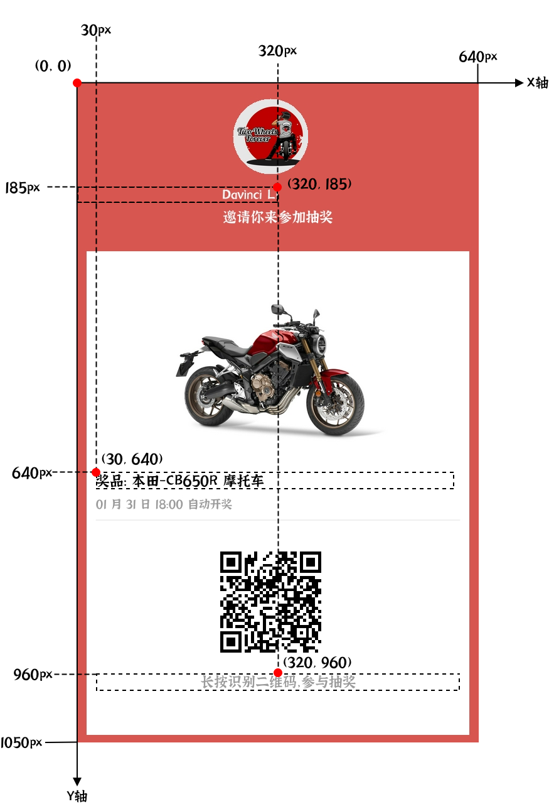

# 文本

## 参数

| 字段名      | 数据类型 | 默认值       | 必需 | 描述                                                     |
| :-----------: | :--------: | :------------: | :----: | ------------------------------------------------------------ |
| x           | int      |              | yes  | 文本 X 坐标                                                  |
| y           | int      |              | yes  | 文本 Y 坐标                                                  |
| text        | string   |              | yes  | 文本内容                                                     |
| width       | int      |              | yes  | 文本宽度，决定了文本的最大显示宽度，当文字内容超过宽度，会自动换行 |
| font        | string   |  SourceHanSansSC-Normal   |      | 选择文本渲染使用的字体，请参考 [可用字体](#字体) |
| fontSize    | int      | 18           |      | 文字大小，单位为pt                                           |
| lineHeight  | int      | 字体基础高度 |      | 文本行高，不能小于`fontSize`                                 |
| lineSpacing | float    | 1            |      | 行距倍数，`lineSpacing * fontSize = lineHeight`              |
| color       | Array    | #000000      |      | 文本颜色                                                     |
| textAlign   | string   | `left`       |      | 文本水平对齐方式，可选值有：`left`、`center`、`right`        |
| zIndex      | int      | 0            |      | 渲染层级，会影响同一位置不同内容的覆盖情况                   |


:::note
由于相同大小的不同字体，文本实际渲染效果可能与设计稿有差异，可根据渲染效果进行微调。
:::

## 定位锚点



字体组件属性`textAlign`会影响文本的定位锚点。

如上图所示，虚线框为文字展示宽与行高。文本`奖品：本田-CB650R`的 `textAlign` 属性值为`left`，则锚点在文本的「左上角」。

文本 `长按识别二维码，参与抽奖` 的 `textAlign` 属性值为 `center`，则锚点在文本「中上」位置。

文本 `Davinci Li` 的 `textAlign` 属性值为 `right`，则锚点在文本「右上角」。

## 字体
目前暂不支持使用自定义字体。imgrender 目前提供以下可免费商用的字体：

:::tip
👉 若想新增更多可免费商用的字体，请添加开发者公众号留言。


:::

| 字体名                      | 中文名              |
| --------------------------- | :-------------------: |
| jiangxizhuokai              | 江西拙楷            |  
| slideyouran                 | 演示悠然小楷]       |
| SourceHanSansSC-Heavy       | 思源黑体-特粗       |
| SourceHanSansSC-Bold        | 思源黑体-粗         |
| SourceHanSansSC-Medium      | 思源黑体-中等       |
| SourceHanSansSC-Regular     | 思源黑体-常规       |
| SourceHanSansSC-Normal      | 思源黑体-标准       |
| SourceHanSansSC-Light       | 思源黑体-细         |
| SourceHanSansSC-ExtraLight  | 思源黑体-特细       |
| SourceHanSerifCN-Heavy      | 思源宋体-特粗       |
| SourceHanSerifCN-Bold       | 思源宋体-粗         |
| SourceHanSerifCN-SemiBold   | 思源宋体-半粗       |
| SourceHanSerifCN-Medium     | 思源宋体-中等       |
| SourceHanSerifCN-Regular    | 思源宋体-常规       |
| SourceHanSerifCN-Light      | 思源宋体-细         |
| SourceHanSerifCN-ExtraLight | 思源宋体-特细       |
| Alibaba-PuHuiTi-Heavy       | 阿里巴巴普惠体-特粗 |
| Alibaba-PuHuiTi-Bold        | 阿里巴巴普惠体-粗   |
| Alibaba-PuHuiTi-Medium      | 阿里巴巴普惠体-中等 |
| Alibaba-PuHuiTi-Regular     | 阿里巴巴普惠体-常规 |
| Alibaba-PuHuiTi-Light       | 阿里巴巴普惠体-细   |


## 示例
```json
{
    "x": 320,
    "y": 185,
    "text": "Davinci Li",
    "font": "SourceHanSansSC-Normal",
    "fontSize": 22,
    "color": "#fff",
    "width": 320,
    "textAlign": "center"
}
```