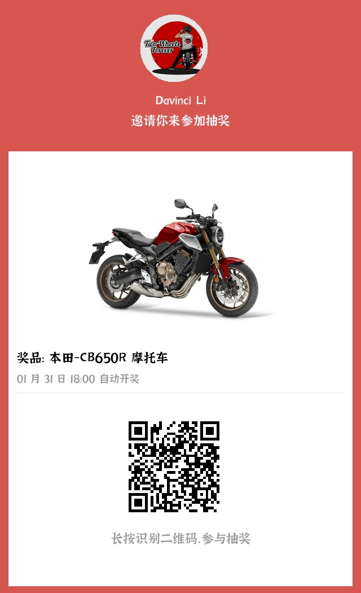
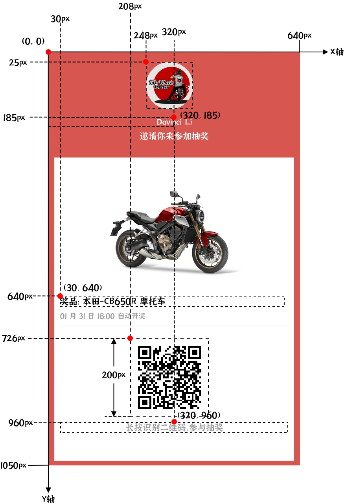

## 效果

<!--  -->

## 设计稿

<!--  -->

## 完整配置
```json
{
    "width": 640,
    "height": 1050,
    "backgroundColor": "#d75650",
    "blocks":[
        {
            "x": 15,
            "y": 268,
            "width": 610,
            "height": 770,
            "backgroundColor": "#fff",
            "borderColor": "#fff"
        }
    ],
    "texts":[
        {
            "x": 320,
            "y": 185,
            "text": "Davinci Li",
            "font": "jiangxizhuokai",
            "fontSize": 22,
            "color": "#fff",
            "width": 320,
            "textAlign": "center"
        },
        {
            "x": 320,
            "y": 220,
            "text": "邀请你来参加抽奖",
            "font": "jiangxizhuokai",
            "fontSize": 22,
            "color": "#fff",
            "width": 320,
            "textAlign": "center"
        },
        {
            "x": 30,
            "y": 640,
            "text": "奖品: 本田-CB650R 摩托车",
            "font": "jiangxizhuokai",
            "fontSize": 22,
            "color": "#000",
            "width": 580,
            "textAlign": "left"
        },
        {
            "x": 30,
            "y": 676,
            "text": "01 月 31 日 18:00 自动开奖",
            "font": "jiangxizhuokai",
            "fontSize": 18,
            "color": "#9a9a9a",
            "width": 580,
            "textAlign": "left"
        },
        {
            "x": 320,
            "y": 960,
            "text": "长按识别二维码，参与抽奖",
            "font": "jiangxizhuokai",
            "fontSize": 22,
            "color": "#9a9a9a",
            "width": 580,
            "textAlign": "center"
        }
    ],
    "lines":[
        {
            "startX": 30,
            "startY": 696,
            "endX": 610,
            "endY": 696,
            "width": 1,
            "color": "#E1E1E1",
            "zIndex": 1
        }
    ],
    "images":[
        {
            "x": 248,
            "y": 25,
            "width": 120,
            "height": 120,
            "url": "https://img-chengxiaoli-1253325493.cos.ap-beijing.myqcloud.com/bikers_327390-13.jpg",
            "borderRadius": 60,
            "zIndex": 1
        },
        {
            "x": 108,
            "y": 285,
            "width": 400,
            "height": 300,
            "url": "https://img-chengxiaoli-1253325493.cos.ap-beijing.myqcloud.com/cb650R.jpeg",
            "zIndex": 1
        }
    ],
    "qrcodes":[
        {
            "x": 208,
            "y": 726,
            "size": 200,
            "content": "http://weixin.qq.com/r/yRzk-JbEbMsTrdKf90nb",
            "foregroundColor": "#000",
            "backgroundColor": "#fff",
            "zIndex": 1
        }
    ]
}
```
