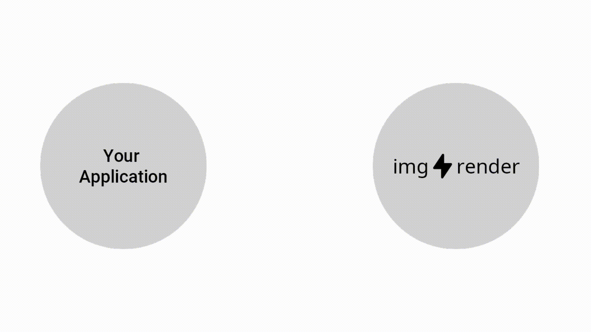

# 快速开始
[imgrender](https://www.imgrender.cn) 是一个图片生成服务，可以根据模板动态地生成图片。

渲染模板配置简单，特别适合拥有不同分享海报的应用，快速、动态地生成分享海报。



## 基础
HTTP 接口地址如下：
```bash
POST https://api.imgrender.cn/open/v1/pics
```

## 验证

imgrender 使用 `api key` 对服务进行授权。

为了成功调用服务，请在所有 API 请求中都传递 api key，标头如下所示：

```
X-API-Key: API_KEY
```

:::tip
[获取您的 API 密钥](https://app.imgrender.cn)

目前免费且没有数量限制。
:::

## 请求内容
请求头中除了签名认证的内容以外，需要添加`Content-Type:application/json`，渲染配置使用 `JSON` 格式在 `Body` 中传递。

如何编写渲染配置，请参考[蓝图](/docs/blueprint)。下面是参考示例：

```json
{
    "width": 640,
    "height": 1034,
    "backgroundColor": "#d04c44",
    "blocks": [
        {
            "x": 25,
            "y": 25,
            "width": 590,
            "height": 820,
            "borderColor": "#ffe6c0",
            "borderWidth": 2
        }
    ],
    "texts": [
        {
            "text": "帅帅气气",
            "x": 320,
            "y": 187,
            "font": "jiangxizhuokai",
            "fontSize": 18,
            "lineHeight": 18,
            "color": "#ffe6c0",
            "width": 320,
            "textAlign": "center"
        }
    ],
    "images": [],
    "lines": []
}
```
## 响应
响应内容会按照以下`JSON`格式返回

```json
{
  "code": 0,
  "message": "ok",
  "data": {
    "url": "https://davinci.imgrender.cn/6e31cfcd683a36d0522a8cc34e244379.jpg?sign=xxx",
    "expireAt": "2021-06-21 15:20:21"
  }
}
```

- ` code `：错误码，当错误码为 `0` 时，表示处理成功，其他值表示存在一定的问题。
- `message`：提示信息，与`code`相对应，更多提示信息可查看[错误码列表](#错误码)。
- `data` ：返回的数据。当 `code` 为 `0` 时，返回有效时长为`5分钟`的图片链接。`url` 为图片链接，`expireAt` 为图片链接过期时间。

## HTTP 状态码
- `200`：处理成功。
- `400`: 请求失败。
- `401`：请求未通过认证。
- `500`：系统错误，出现这个状态一般是服务出现问题。


## 错误码
- `0`: 成功，无错误产生。
- `10001`: 系统发生预期之外的错误
- `10103`: 参数错误，请检查 HTTP 请求是否正确。
- `10104`：请求签名信息有误，请检查请求是否正确添加验证信息。
- `20101`: 图片加载失败，请检查图片组件中的图片链接是否可正常访问。
- `20102`: 图片解析失败，可能图片格式不正确，推荐使用 `jpg / png` 格式的图片。
- `20103`: 字体加载失败，请检查文本组件的字体配置。
- `20104`: 字体解析失败，一般不会出现。
- `20105`: 图片渲染错误，在渲染海报的过程中，出现一些预期之外的错误。
- `20106`: 渲染配置错误，出现该错误说明图片渲染配置存在问题，请根据提示信息排查。


## 示例代码

import Tabs from '@theme/Tabs';
import TabItem from '@theme/TabItem';

<Tabs>
  <TabItem value="curl" label="curl" default>

```bash
curl --location --request POST 'https://api.imgrender.cn/open/v1/pics' \
--header 'X-API-Key: 替换为你的 API 密钥 \
--header 'Content-Type: application/json' \
--data-raw '{
    "width": 600,
    "height": 966,
    "backgroundColor": "#655f55",
    "blocks": [],
    "qrcodes": []
}'
```

  </TabItem>
  <TabItem value="nodejs" label="JavaScript-Fetch">

```js
var myHeaders = new Headers();
myHeaders.append("X-API-Key", "替换为你的 API 密钥");
myHeaders.append("Content-Type", "application/json");

var raw = JSON.stringify({
    "width": 600,
    "height": 966,
    "backgroundColor": "#655f55",
    "blocks": [],
    "qrcodes": []
});

var requestOptions = {
    method: 'POST',
    headers: myHeaders,
    body: raw,
    redirect: 'follow'
};

fetch("https://api.imgrender.cn/open/v1/pics", requestOptions)
    .then(response => response.text())
    .then(result => console.log(result))
    .catch(error => console.log('error', error));
```

  </TabItem>
  <TabItem value="Python" label="Python">

```python
import requests
import json

url = "https://api.imgrender.cn/open/v1/pics"

payload = json.dumps({
   "width": 600,
   "height": 966,
   "backgroundColor": "#655f55",
   "blocks": [],
   "qrcodes": []
})
headers = {
   'X-API-Key': '替换为你的 API 密钥',
   'Content-Type': 'application/json',
}

response = requests.request("POST", url, headers=headers, data=payload)

print(response.text)
```

  </TabItem>
  <TabItem value="Golang" label="Golang">

```go
package main

import (
   "fmt"
   "strings"
   "net/http"
   "io/ioutil"
)

func main() {

   url := "https://api.imgrender.cn/open/v1/pics"
   method := "POST"

   payload := strings.NewReader(`{`+"
"+`
    "width": 600,`+"
"+`
    "height": 966,`+"
"+`
    "backgroundColor": "#655f55",`+"
"+`
    "blocks": [],`+"
"+`
    "qrcodes": []`+"
"+`
}`)

   client := &http.Client {
   }
   req, err := http.NewRequest(method, url, payload)

   if err != nil {
      fmt.Println(err)
      return
   }
   req.Header.Add("X-API-Key", "替换为你的 API 密钥")
   req.Header.Add("Content-Type", "application/json")

   res, err := client.Do(req)
   if err != nil {
      fmt.Println(err)
      return
   }
   defer res.Body.Close()

   body, err := ioutil.ReadAll(res.Body)
   if err != nil {
      fmt.Println(err)
      return
   }
   fmt.Println(string(body))
}
```
  </TabItem>
  <TabItem value="Ruby" label="Ruby">

```ruby
require "uri"
require "json"
require "net/http"

url = URI("https://api.imgrender.cn/open/v1/pics")

https = Net::HTTP.new(url.host, url.port)
https.use_ssl = true

request = Net::HTTP::Post.new(url)
request["X-API-Key"] = "替换为你的 API 密钥"
request["Content-Type"] = "application/json"
request.body = JSON.dump({
   "width": 600,
   "height": 966,
   "backgroundColor": "#655f55",
   "blocks": [],
   "qrcodes": []
})

response = https.request(request)
puts response.read_body
```

  </TabItem>
  <TabItem value="PHP" label="PHP">

```php
<?php

$curl = curl_init();

curl_setopt_array($curl, array(
   CURLOPT_URL => 'https://api.imgrender.cn/open/v1/pics',
   CURLOPT_RETURNTRANSFER => true,
   CURLOPT_ENCODING => '',
   CURLOPT_MAXREDIRS => 10,
   CURLOPT_TIMEOUT => 0,
   CURLOPT_FOLLOWLOCATION => true,
   CURLOPT_HTTP_VERSION => CURL_HTTP_VERSION_1_1,
   CURLOPT_CUSTOMREQUEST => 'POST',
   CURLOPT_POSTFIELDS =>'{
    "width": 600,
    "height": 966,
    "backgroundColor": "#655f55",
    "blocks": [],
    "qrcodes": []
}',
   CURLOPT_HTTPHEADER => array(
      'X-API-Key: 替换为你的 API 密钥',
      'Content-Type: application/json',
   ),
));

$response = curl_exec($curl);

curl_close($curl);
echo $response;
```

  </TabItem>
  <TabItem value="Java" label="Java">

```java
OkHttpClient client = new OkHttpClient().newBuilder()
   .build();
MediaType mediaType = MediaType.parse("application/json");
RequestBody body = RequestBody.create(mediaType, "{\r\n    \"width\": 600,\r\n    \"height\": 966,\r\n    \"backgroundColor\": \"#655f55\",\r\n    \"blocks\": [],\r\n    \"qrcodes\": []\r\n}");
Request request = new Request.Builder()
   .url("https://api.imgrender.cn/open/v1/pics")
   .method("POST", body)
   .addHeader("X-API-Key", "替换为你的 API 密钥")
   .addHeader("Content-Type", "application/json")
   .build();
Response response = client.newCall(request).execute();
```

  </TabItem>
</Tabs>